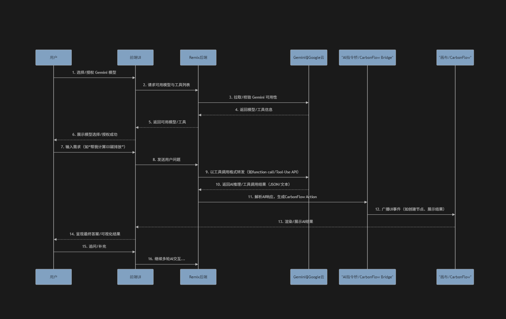

# For Google Expert



## 🎥 产品演示

### 方式一：直接嵌入MP4视频（推荐）
<!-- 将你的demo.mp4文件放到 public/videos/ 目录下 -->
<video width="800" controls>
  <source src="./public/videos/demo.mp4" type="video/mp4">
  <source src="./public/videos/demo.webm" type="video/webm">
  您的浏览器不支持视频标签。
</video>

### 方式二：YouTube/B站嵌入
<!-- 替换为你的实际视频链接 -->
[](https://www.youtube.com/watch?v=YOUR_VIDEO_ID)

### 方式三：GIF动图演示
<!-- 如果视频文件太大，也可以转换为GIF -->


## 项目核心

本平台围绕两个核心模块展开，协同实现"AI驱动的产品碳足迹全流程管理"：

### 1. Chat 碳顾问（AI Carbon Consultant）

**简介：**  
Chat 碳顾问是平台的智能中枢，基于先进的大语言模型（如 Gemini），为用户提供7x24小时的对话式碳管理服务。用户可以像与专业顾问交流一样，通过自然语言提出任何与碳足迹相关的问题或需求，系统会智能理解意图，自动调用知识库、工具和数据，给出专业、合规、可落地的建议。

**主要功能：**
- **智能问答**：支持碳核算、合规、减排、供应链管理等多领域问题的实时解答
- **流程引导**：根据用户输入，动态生成碳足迹建模、数据收集、报告编制等操作流程
- **工具联动**：自动调用数据解析、因子匹配、LCA计算等工具，提升工作效率
- **合规保障**：内置ISO 14067、GHG Protocol等主流标准知识，规避"漂绿"风险
- **多轮对话**：支持复杂业务场景下的多轮追问、澄清与补充，真正实现"AI碳分析师"体验

**创新与优势：**
- 彻底简化传统碳管理的学习与操作门槛，让非专业用户也能高效完成复杂任务
- 可持续进化的知识库与数据飞轮，越用越聪明
- 支持多模态输入（如文本、表格、图片、PDF等），未来可扩展至语音、视频等场景

### 2. CarbonFlow 可视化建模与计算工作台

**简介：**  
CarbonFlow 是面向产品碳足迹（PCF）建模与生命周期分析（LCA）的可视化工作台。用户可通过拖拽、编辑等直观操作，快速搭建产品工艺流程、物料清单（BOM）、能耗与排放节点，系统自动生成生命周期流程图，并对接高性能LCA计算引擎，实现从数据输入、流程建模到碳排放计算、报告生成的全流程闭环。

**主要功能：**
- **流程图编辑**：支持节点、边、分支、循环等复杂工艺流程的可视化建模
- **数据集成**：可导入企业ERP、MES、供应链等多源数据，自动识别并填充关键参数
- **LCA计算**：内置Brightway2等主流LCA引擎，支持多种分配方法与不确定性分析
- **合规报告**：一键生成符合ISO 14067、GHG Protocol、CBAM等标准的PCF报告
- **结果可视化**：支持热点分析、敏感性分析、趋势预测等多维度数据展示

**创新与优势：**
- 极大降低LCA建模门槛，非LCA专家也能轻松上手
- 支持AI自动补全流程、智能推荐碳因子、异常检测等智能化能力
- 可与Chat碳顾问无缝联动，实现"对话+可视化"一体化体验
- 未来可扩展至供应链协同、全生命周期管理、碳减排路径智能推荐等高级场景

**未来展望：**  
随着平台的持续演进，Chat碳顾问与CarbonFlow将形成强大的智能协同体，不仅能服务企业自身的碳管理，还能赋能上下游供应链、第三方审核机构，推动全行业的低碳转型与合规创新。


#### 项目启动

1. **克隆仓库**：

   ```bash
   git clone https://github.com/AllenPeng0209/carbonflow.git
   ```

2. **安装依赖**：

   ```bash
   pnpm install
   ```

3. **启动开发服务器**：
   ```bash
   pnpm run dev
   ```


