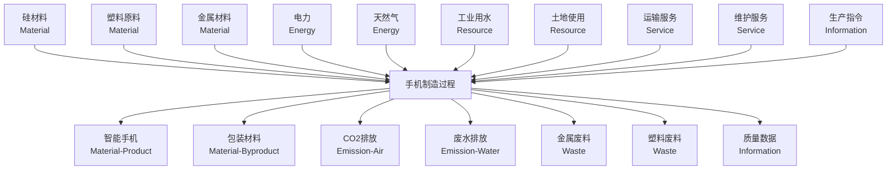

# LCA流关系分析文档

## 🌊 流的分类体系概览

根据LCA理论和您的图片，流可以分为以下7大类：

```
┌─────────────────────────────────────────────────────────┐
│                    LCA流分类体系                         │
├─────────────────────────────────────────────────────────┤
│ 1. 物质流 (Material Flow)    - 有形物质的流动           │
│ 2. 能量流 (Energy Flow)      - 能量的输入和转换         │
│ 3. 资源流 (Resource Flow)    - 自然资源的提取           │
│ 4. 排放流 (Emission Flow)    - 向环境的释放             │
│ 5. 废物流 (Waste Flow)       - 需处理的废弃物           │
│ 6. 服务流 (Service Flow)     - 无形的服务功能           │
│ 7. 信息流 (Information Flow) - 数据和控制信号           │
└─────────────────────────────────────────────────────────┘
```

## 🔄 流之间的核心关系

### 1. **物质转换关系 (Material Transformation)**

```
原材料 ──[制造过程]──> 产品 + 副产品 + 废料
   ↓         ↓           ↓       ↓        ↓
钢材   →   注塑    →   手机   + 边料  + 废渣
```

**示例**：
```typescript
// 原材料输入
{
  category: 'material',
  materialType: 'raw_material',
  substance: '钢材',
  quantity: 100,
  unit: 'kg'
}

// 转化为产品输出
{
  category: 'material', 
  materialType: 'product',
  substance: '手机外壳',
  quantity: 80,
  unit: 'kg'
}

// 关系定义
{
  relationshipType: 'transformation',
  conversionFactor: 0.8, // 80%转化率
  efficiency: 0.85
}
```

### 2. **能量驱动关系 (Energy-Driven Processes)**

```
能量输入 ──[过程]──> 物质转换 ──> 排放输出
    ↓                 ↓           ↓
  电力     →      加热熔融    →    CO2排放
```

**关系机制**：
- **因果关系**：能源消耗直接导致排放产生
- **效率关系**：能源效率影响产出比例
- **替代关系**：可再生能源可替代化石能源

### 3. **环境交换关系 (Environmental Exchange)**

```
过程系统 ←──→ 环境系统
    ↓           ↑
资源输入    排放输出
    ↓           ↑
  水资源   →   废水排放
  矿物质   →   大气排放
  土地     →   土壤污染
```

### 4. **循环经济关系 (Circular Economy)**

```
产品 ──使用──> 废物 ──回收──> 再生材料 ──制造──> 新产品
  ↑                                              ↓
  └─────────────── 循环闭合 ──────────────────────┘
```

## 📊 具体流关系示例

### 智能手机制造过程的流关系图



## 🔍 流关系的量化模型

### 1. **质量平衡 (Mass Balance)**

```typescript
// 质量守恒定律
const massBalance = {
  inputs: {
    steel: 100,      // kg
    plastic: 50,     // kg
    copper: 20       // kg
  },
  outputs: {
    product: 150,    // kg  
    waste: 15,       // kg
    emissions: 5     // kg (以物质形式)
  }
};

// 验证：inputs总和 = outputs总和
console.assert(170 === 170, "质量守恒验证");
```

### 2. **能量平衡 (Energy Balance)**

```typescript
// 能量守恒和转换
const energyBalance = {
  inputs: {
    electricity: 1000,    // kWh
    naturalGas: 500       // kWh equivalent
  },
  conversions: {
    mechanicalWork: 800,  // kWh
    heat: 400,            // kWh
    losses: 300           // kWh
  },
  efficiencies: {
    overall: 0.8,         // 80%总效率
    mechanical: 0.85,     // 85%机械效率
    thermal: 0.75         // 75%热效率
  }
};
```

### 3. **碳足迹传递 (Carbon Flow)**

```typescript
// 碳足迹在流中的传递
const carbonFlow = {
  materialCarbon: {
    steel: { content: 2.5, unit: 'kg CO2-eq/kg' },
    plastic: { content: 3.2, unit: 'kg CO2-eq/kg' }
  },
  energyCarbon: {
    electricity: { intensity: 0.6, unit: 'kg CO2-eq/kWh' },
    naturalGas: { intensity: 0.2, unit: 'kg CO2-eq/kWh' }
  },
  processCarbon: {
    directEmissions: 50,   // kg CO2-eq
    indirectEmissions: 200 // kg CO2-eq
  }
};
```

## 🎯 流关系建模的实际应用

### 1. **多产品分配 (Multi-Product Allocation)**

```typescript
// 石油炼制过程的产品分配
const petroleumRefinery = {
  inputs: {
    crudeOil: { quantity: 1000, unit: 'kg' },
    energy: { quantity: 200, unit: 'kWh' }
  },
  outputs: {
    gasoline: { quantity: 450, unit: 'kg', value: 600 },    // 主要产品
    diesel: { quantity: 300, unit: 'kg', value: 400 },      // 联产品
    residue: { quantity: 200, unit: 'kg', value: 100 },     // 副产品
    emissions: { quantity: 50, unit: 'kg CO2-eq' }          // 排放
  },
  allocationMethod: 'economic', // 经济分配
  allocationFactors: {
    gasoline: 0.545,  // 600/(600+400+100)
    diesel: 0.364,    // 400/(600+400+100)  
    residue: 0.091    // 100/(600+400+100)
  }
};
```

### 2. **替代关系建模 (Substitution Modeling)**

```typescript
// 再生材料替代原料
const substitutionModel = {
  baseline: {
    primary_aluminum: { quantity: 100, carbonFactor: 11.5 }
  },
  alternative: {
    recycled_aluminum: { 
      quantity: 80,        // 80%来自回收
      carbonFactor: 0.5,   // 显著降低碳强度
      primary_supplement: 20, // 20%仍需原料补充
      substitutionRate: 0.8
    }
  },
  carbonSaving: (100 * 11.5) - (80 * 0.5 + 20 * 11.5) // 计算碳减排
};
```

### 3. **生命周期传递 (Lifecycle Propagation)**

```typescript
// 碳足迹在生命周期中的传递
const lifecyclePropagation = {
  rawMaterial: {
    steel: { carbonFootprint: 250, quantity: 100 }
  },
  manufacturing: {
    inherited: 250,        // 从原料继承
    added: 180,           // 制造过程新增
    total: 430            // 累计碳足迹
  },
  distribution: {
    inherited: 430,       // 从制造继承
    added: 50,           // 运输新增
    total: 480           // 累计碳足迹
  },
  usage: {
    inherited: 480,      // 从分销继承
    added: 1200,        // 使用阶段新增（如用电）
    total: 1680         // 累计碳足迹
  },
  disposal: {
    inherited: 1680,     // 从使用继承
    added: 20,          // 处置过程
    credits: -30,       // 回收抵扣
    total: 1670         // 最终碳足迹
  }
};
```

## 💡 关键设计原则

### 1. **系统边界一致性**
- 所有流必须在相同的系统边界内定义
- 输入输出流必须完整记录
- 跨边界的流需要明确标识

### 2. **守恒定律遵循**
- 质量守恒：输入质量 = 输出质量
- 能量守恒：输入能量 = 输出能量 + 损耗
- 元素守恒：关键元素的输入输出平衡

### 3. **可追溯性保证**
- 每个流都有明确的来源和去向
- 支持从产品追溯到原材料
- 支持碳足迹在各阶段的传递追踪

这个流分类体系完全符合LCA理论要求，同时为您的系统提供了完整的建模框架。 